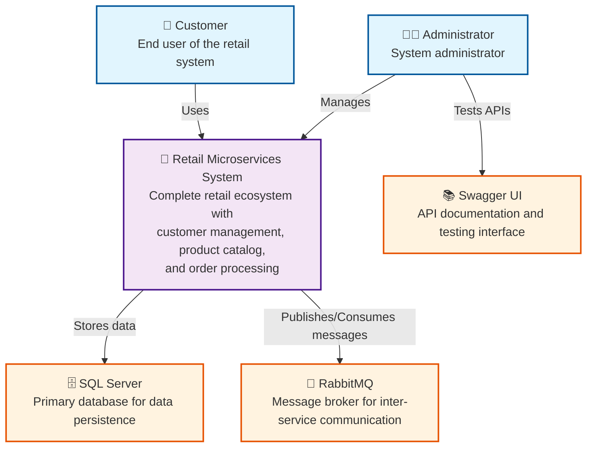
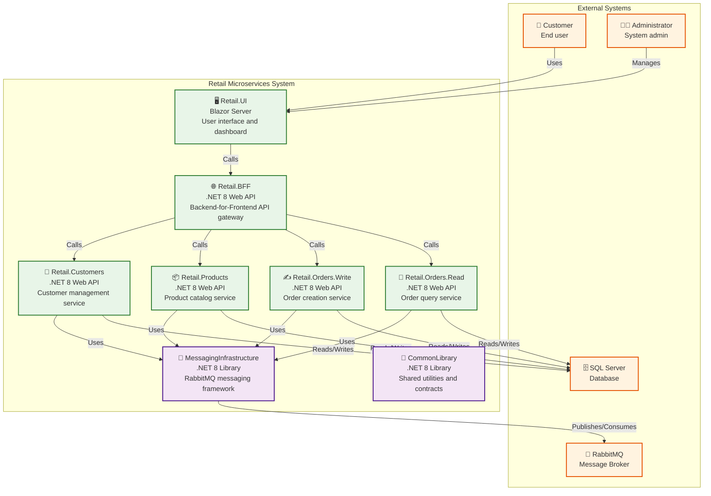
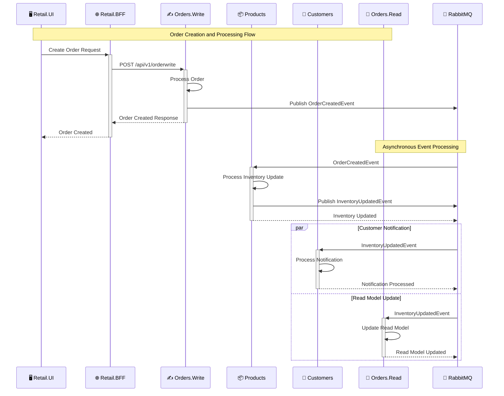

# Retail Microservices Service Manual

Operational guide for running and maintaining the retail microservices system.

## Services

1. **Retail.Customers** (7001): Customer management
2. **Retail.Products** (7003): Product catalog and inventory
3. **Retail.Orders.Write** (7002): Order creation (CQRS write side)
4. **Retail.Orders.Read** (7005): Order queries (CQRS read side)
5. **Retail.BFF** (7004): API gateway for frontend
6. **Retail.UI** (7000): Web interface

**Infrastructure**: CommonLibrary, MessagingInfrastructure (RabbitMQ), Contracts

## System Context Diagram

## Container Diagram

## Service Details

### Retail.Customers (7001)
**Purpose**: Customer CRUD, profile management, notifications  
**Database**: `Retail.Customer`  
**API**: `/api/v1/customer` (CRUD), `/api/v1/notification`  
**Events**: Subscribes to `InventoryUpdatedEvent`

### Retail.Products (7003)
**Purpose**: Product CRUD, inventory management  
**Database**: `Retail.Product`  
**API**: `/api/v1/product` (CRUD), `/api/v1/product/{id}/inventory`  
**Events**: Subscribes to `OrderCreatedEvent`, publishes `InventoryUpdatedEvent`, `InventoryErrorEvent`

### Retail.Orders.Write (7002)
**Purpose**: Order creation and updates (CQRS write)  
**Database**: `Retail.Order`  
**API**: `/api/v1/orderwrite` (POST, PUT, DELETE)  
**Events**: Publishes `OrderCreatedEvent`, `OrderUpdatedEvent`, `OrderCancelledEvent`

### Retail.Orders.Read (7005)
**Purpose**: Order queries (CQRS read)  
**Database**: `Retail.Order` (read model)  
**API**: `/api/v1/orderread` (GET all/by ID/by customer)  
**Events**: Subscribes to `InventoryUpdatedEvent`

### Retail.BFF (7004)
**Purpose**: API gateway aggregating data from all services  
**API**: `/api/v1/bff/orders`, `/api/v1/bff/customers`, `/api/v1/bff/products`  
**Dependencies**: HTTP calls to all microservices

## Event Flow

**Order Creation**: Orders.Write → OrderCreatedEvent → Products → InventoryUpdatedEvent → Customers/Orders.Read

**Error Handling**: Products → InventoryErrorEvent → Orders.Write → OrderCancelledEvent

See [Design Documentation](../Design/README.md) for detailed diagrams.

## Dependencies

**External**: SQL Server, RabbitMQ, .NET 8 Runtime  
**Internal**: CommonLibrary, MessagingInfrastructure, Entity Framework Core, AutoMapper, MediatR

## Health Checks

- `/health` - Service health status
- `/swagger` - API documentation

## Configuration

**Database**: Connection strings in `appsettings.json`  
**RabbitMQ**: HostName, Port, Username, Password in `TopologyConfiguration`  
**Ports**: 7000-7005 (see service list above)

**Deployment**: See [Deployment Guide](./Deployment.md) for detailed deployment instructions.

## Troubleshooting

**Service won't start**: Check database connection, RabbitMQ status, port conflicts, config files

**Messages not processing**: Check RabbitMQ queues, verify contracts, ensure services running

**Database errors**: Verify SQL Server status, check connection strings, review connection pool

**API failures**: Check service endpoints, network connectivity, API versions

## Performance & Security

**Scaling**: Services scale independently, use load balancing  
**Optimization**: Connection pooling, async processing  
**Security**: API keys for service-to-service, JWT for users, HTTPS/TLS, input validation

## Maintenance

**Regular**: Database backups, log rotation, security updates  
**Disaster Recovery**: Service redundancy, database backups, message queue persistence
