# Retail Microservices Service Manual

## Overview

This document provides operational guidance for the Retail Microservices .NET 8 system, which implements a retail ecosystem using microservices architecture. The system consists of six microservices that handle customer management, product catalog, order processing, and a Backend-for-Frontend (BFF) API gateway.

## System Architecture

The retail system uses a microservices architecture with event-driven communication patterns. The Orders service implements CQRS (Command Query Responsibility Segregation) pattern with separate read and write services.

### Core Microservices

1. **Retail.Customers** (Port 7001): Customer management and profile services
2. **Retail.Products** (Port 7003): Product catalog and inventory management  
3. **Retail.Orders.Write** (Port 7002): Order creation and processing (Write side)
4. **Retail.Orders.Read** (Port 7005): Order querying and reporting (Read side)
5. **Retail.BFF** (Port 7004): Backend-for-Frontend API gateway
6. **Retail.UI** (Port 7000): User interface and dashboard

### Supporting Infrastructure

- **CommonLibrary**: Shared libraries and utilities
- **MessagingInfrastructure**: RabbitMQ messaging framework
- **Contracts**: API contracts and specifications (OpenAPI/AsyncAPI)

## System Context Diagram

```mermaid
graph TB
    Customer["👤 Customer<br/>End user of the retail system"]
    Admin["👨‍💼 Administrator<br/>System administrator"]
    
    RetailSystem["🏪 Retail Microservices System<br/>Complete retail ecosystem with<br/>customer management, product catalog,<br/>and order processing"]
    
    SQLServer["🗄️ SQL Server<br/>Primary database for data persistence"]
    RabbitMQ["🐰 RabbitMQ<br/>Message broker for inter-service communication"]
    Swagger["📚 Swagger UI<br/>API documentation and testing interface"]
    
    Customer -->|Uses| RetailSystem
    Admin -->|Manages| RetailSystem
    RetailSystem -->|Stores data| SQLServer
    RetailSystem -->|Publishes/Consumes messages| RabbitMQ
    Admin -->|Tests APIs| Swagger
    
    classDef person fill:#e1f5fe,stroke:#01579b,stroke-width:2px
    classDef system fill:#f3e5f5,stroke:#4a148c,stroke-width:2px
    classDef external fill:#fff3e0,stroke:#e65100,stroke-width:2px
    
    class Customer,Admin person
    class RetailSystem system
    class SQLServer,RabbitMQ,Swagger external
```



## Container Diagram

```mermaid
graph TB
    subgraph "External Systems"
        Customer["👤 Customer<br/>End user"]
        Admin["👨‍💼 Administrator<br/>System admin"]
        SQLServer["🗄️ SQL Server<br/>Database"]
        RabbitMQ["🐰 RabbitMQ<br/>Message Broker"]
    end
    
    subgraph "Retail Microservices System"
        UI["🖥️ Retail.UI<br/>Blazor Server<br/>User interface and dashboard"]
        BFF["🌐 Retail.BFF<br/>.NET 8 Web API<br/>Backend-for-Frontend API gateway"]
        Customers["👥 Retail.Customers<br/>.NET 8 Web API<br/>Customer management service"]
        Products["📦 Retail.Products<br/>.NET 8 Web API<br/>Product catalog service"]
        OrdersWrite["✍️ Retail.Orders.Write<br/>.NET 8 Web API<br/>Order creation service"]
        OrdersRead["📖 Retail.Orders.Read<br/>.NET 8 Web API<br/>Order query service"]
        Messaging["📨 MessagingInfrastructure<br/>.NET 8 Library<br/>RabbitMQ messaging framework"]
        Common["🔧 CommonLibrary<br/>.NET 8 Library<br/>Shared utilities and contracts"]
    end
    
    Customer -->|Uses| UI
    Admin -->|Manages| UI
    UI -->|Calls| BFF
    BFF -->|Calls| Customers
    BFF -->|Calls| Products
    BFF -->|Calls| OrdersWrite
    BFF -->|Calls| OrdersRead
    
    OrdersWrite -->|Uses| Messaging
    Products -->|Uses| Messaging
    Customers -->|Uses| Messaging
    OrdersRead -->|Uses| Messaging
    Messaging -->|Publishes/Consumes| RabbitMQ
    
    Customers -->|Reads/Writes| SQLServer
    Products -->|Reads/Writes| SQLServer
    OrdersWrite -->|Reads/Writes| SQLServer
    OrdersRead -->|Reads/Writes| SQLServer
    
    classDef external fill:#fff3e0,stroke:#e65100,stroke-width:2px
    classDef microservice fill:#e8f5e8,stroke:#2e7d32,stroke-width:2px
    classDef infrastructure fill:#f3e5f5,stroke:#4a148c,stroke-width:2px
    
    class Customer,Admin,SQLServer,RabbitMQ external
    class UI,BFF,Customers,Products,OrdersWrite,OrdersRead microservice
    class Messaging,Common infrastructure
```



## Service Details

### 1. Retail.Customers Service

**Purpose**: Manages customer profiles and customer-related operations.

**Key Responsibilities**:
- Customer CRUD operations
- Customer profile management
- Notification handling for order events

**API Endpoints** (Internal - accessed only by BFF):
- `GET /api/v1/customer` - Get all customers
- `GET /api/v1/customer/{id}` - Get customer by ID
- `POST /api/v1/customer` - Create new customer
- `PUT /api/v1/customer/{id}` - Update customer
- `DELETE /api/v1/customer/{id}` - Delete customer
- `GET /api/v1/notification` - Get customer notifications

**Database**: `Retail.Customer` (SQL Server)

**Message Handling**:
- Subscribes to: `InventoryUpdatedEvent` from Products service
- Publishes: `CustomerUpdatedEvent` when customer data changes

### 2. Retail.Products Service

**Purpose**: Manages product catalog and product-related operations.

**Key Responsibilities**:
- Product CRUD operations
- Inventory management
- Stock level tracking

**API Endpoints** (Internal - accessed only by BFF):
- `GET /api/v1/product` - Get all products
- `GET /api/v1/product/{id}` - Get product by ID
- `POST /api/v1/product` - Create new product
- `PUT /api/v1/product/{id}` - Update product
- `DELETE /api/v1/product/{id}` - Delete product
- `PUT /api/v1/product/{id}/inventory` - Update inventory

**Database**: `Retail.Product` (SQL Server)

**Message Handling**:
- Subscribes to: `OrderCreatedEvent` from Orders.Write service
- Publishes: `InventoryUpdatedEvent` when inventory changes

### 3. Retail.Orders.Write Service

**Purpose**: Handles order creation and write-side operations using CQRS pattern.

**Key Responsibilities**:
- Order creation
- Order processing workflow
- Command handling (CQRS)

**API Endpoints** (Internal - accessed only by BFF):
- `POST /api/v1/orderwrite` - Create new order
- `PUT /api/v1/orderwrite/{id}` - Update order
- `DELETE /api/v1/orderwrite/{id}` - Cancel order

**Database**: `Retail.Order` (SQL Server)

**Message Handling**:
- Publishes: `OrderCreatedEvent` when new order is created
- Publishes: `OrderUpdatedEvent` when order is modified
- Publishes: `OrderCancelledEvent` when order is cancelled

### 4. Retail.Orders.Read Service

**Purpose**: Handles order querying and read-side operations using CQRS pattern.

**Key Responsibilities**:
- Order querying
- Read model maintenance
- Query handling (CQRS)

**API Endpoints** (Internal - accessed only by BFF):
- `GET /api/v1/orderread` - Get all orders
- `GET /api/v1/orderread/{id}` - Get order by ID
- `GET /api/v1/orderread/customer/{customerId}` - Get orders by customer

**Database**: `Retail.Order` (SQL Server - Read Model)

**Message Handling**:
- Subscribes to: `InventoryUpdatedEvent` from Products service
- Updates read model when order events occur

### 5. Retail.BFF Service

**Purpose**: Backend-for-Frontend API gateway that aggregates data from multiple microservices.

**Key Responsibilities**:
- API aggregation and orchestration
- Data transformation for UI consumption
- Cross-service data correlation

**API Endpoints** (External - accessed by UI):
- `GET /api/v1/bff/orders` - Get aggregated order data
- `GET /api/v1/bff/customers` - Get customer data
- `GET /api/v1/bff/products` - Get product data
- `POST /api/v1/bff/orders` - Create new order (delegates to Orders.Write)

**Dependencies**: Makes HTTP calls to all other microservices

## Event-Driven Architecture

The system uses RabbitMQ for asynchronous communication between services.

### Message Flow Diagram

```mermaid
sequenceDiagram
    participant UI as 🖥️ Retail.UI
    participant BFF as 🌐 Retail.BFF
    participant OW as ✍️ Orders.Write
    participant P as 📦 Products
    participant C as 👥 Customers
    participant OR as 📖 Orders.Read
    participant RMQ as 🐰 RabbitMQ

    Note over UI,OR: Order Creation and Processing Flow
    
    UI->>+BFF: Create Order Request
    BFF->>+OW: POST /api/v1/orderwrite
    OW->>OW: Process Order
    OW->>RMQ: Publish OrderCreatedEvent
    OW-->>-BFF: Order Created Response
    BFF-->>-UI: Order Created

    Note over RMQ,OR: Asynchronous Event Processing
    
    RMQ->>+P: OrderCreatedEvent
    P->>P: Process Inventory Update
    P->>RMQ: Publish InventoryUpdatedEvent
    P-->>-RMQ: Inventory Updated

    par Customer Notification
        RMQ->>+C: InventoryUpdatedEvent
        C->>C: Process Notification
        C-->>-RMQ: Notification Processed
    and Read Model Update
        RMQ->>+OR: InventoryUpdatedEvent
        OR->>OR: Update Read Model
        OR-->>-RMQ: Read Model Updated
    end
```



### Message Types

**OrderCreatedEvent**:
- Published by: Orders.Write service
- Consumed by: Products service
- Purpose: Trigger inventory updates

**InventoryUpdatedEvent**:
- Published by: Products service
- Consumed by: Customers and Orders.Read services
- Purpose: Notify customers and update read models

**CustomerUpdatedEvent**:
- Published by: Customers service
- Consumed by: Other services as needed
- Purpose: Synchronize customer data changes

## Service Dependencies

### External Dependencies
- **SQL Server**: Primary database for all services
- **RabbitMQ**: Message broker for inter-service communication
- **.NET 8 Runtime**: Application runtime environment

### Internal Dependencies
- **CommonLibrary**: Shared utilities and base classes
- **MessagingInfrastructure**: RabbitMQ messaging framework
- **Entity Framework Core**: ORM for data access
- **AutoMapper**: Object-to-object mapping
- **MediatR**: CQRS implementation (Orders.Write service)

## Health Checks and Monitoring

Each service provides health check endpoints:

### Health Check Endpoints
- `/health` - Basic health status
- `/swagger` - API documentation and testing interface

### Monitoring Capabilities
- **Application Logs**: Structured logging via .NET logging framework
- **Health Status**: Service health monitoring

## Configuration Management

### Key Configuration Areas

**Database Configuration**:
```json
{
  "ConnectionStrings": {
    "DefaultConnection": "Server=localhost;Database=Retail.Customer;Trusted_Connection=true;"
  }
}
```

**RabbitMQ Configuration**:
```json
{
  "TopologyConfiguration": {
    "HostName": "localhost",
    "Port": 5672,
    "Username": "guest",
    "Password": "guest"
  }
}
```

**Service Endpoints**:
- Each service runs on a specific port (7001-7005)
- BFF service aggregates calls to other services
- Swagger UI available on each service for API testing

## Deployment Architecture

### Development Environment
- All services run as separate .NET applications
- SQL Server for development
- RabbitMQ running locally
- Individual service startup and management

### Production Considerations
- Containerized deployment with Docker
- Load balancing for high availability
- Database clustering for SQL Server
- RabbitMQ clustering for message reliability

## Troubleshooting Guide

### Common Issues and Solutions

#### 1. Service Startup Failures
**Symptoms**: Service fails to start or crashes immediately
**Causes**:
- Database connectivity issues
- RabbitMQ connection problems
- Port conflicts
- Configuration errors

**Solutions**:
- Verify database connection strings
- Check RabbitMQ service status
- Ensure ports are available
- Validate configuration files

#### 2. Message Processing Issues
**Symptoms**: Events not being processed, messages stuck in queues
**Causes**:
- RabbitMQ connectivity issues
- Message serialization problems
- Service dependency failures

**Solutions**:
- Check RabbitMQ queue status
- Verify message contracts and serialization
- Ensure all dependent services are running
- Review message routing configuration

#### 3. Database Connection Issues
**Symptoms**: Database operations failing, connection timeouts
**Causes**:
- Database server unavailable
- Connection string misconfiguration
- Connection pool exhaustion

**Solutions**:
- Verify database server status
- Check connection string format
- Review connection pool settings
- Monitor database performance

#### 4. API Integration Issues
**Symptoms**: BFF service failing to aggregate data, service-to-service calls failing
**Causes**:
- Service endpoint misconfiguration
- Network connectivity issues
- Service version mismatches

**Solutions**:
- Verify service endpoint URLs
- Check network connectivity between services
- Ensure API version compatibility
- Review service discovery configuration

## Performance Considerations

### Scalability
- Each service can be scaled independently
- Horizontal scaling supported through load balancing

### Optimization
- Connection pooling for database access
- Asynchronous processing for long-running operations

## Security Considerations

### Authentication and Authorization
- API key authentication for service-to-service communication
- JWT tokens for user authentication

### Data Protection
- Encrypted connections (HTTPS/TLS)
- Input validation and sanitization
- SQL injection prevention through parameterized queries

## Maintenance Procedures

### Regular Maintenance
- Database backup and recovery procedures
- Log rotation and cleanup
- Security updates and patches

### Disaster Recovery
- Service redundancy and failover procedures
- Database backup and restore procedures
- Message queue persistence and recovery

## Support and Contact

For technical support and questions:
- **Documentation**: See `Documentation/` folder for additional resources
- **API Documentation**: Available via Swagger UI on each service
- **Issue Tracking**: Use project issue tracking system

---

*This service manual is maintained by the development team and should be updated as the system evolves.*
